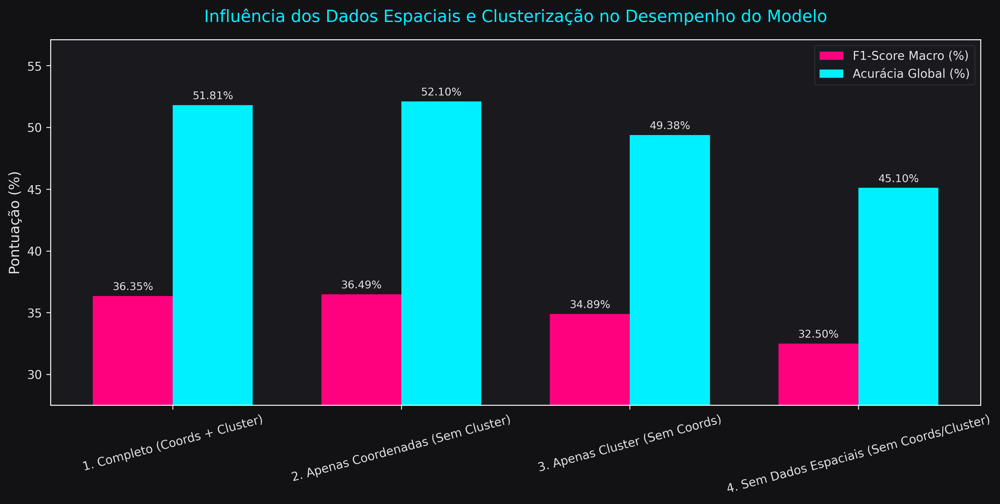
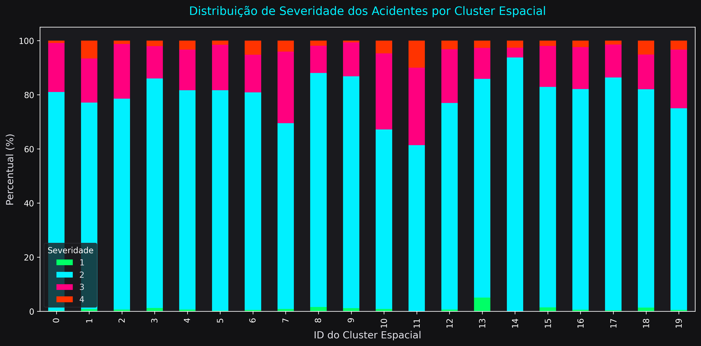
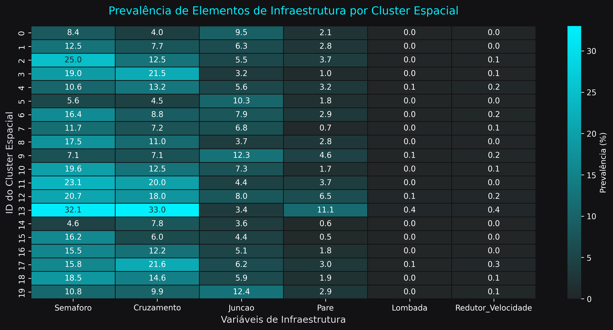

# Relatório de Análise: Influência da Clusterização e Localização no TraficGenius

Este documento apresenta uma análise estatística e preditiva profunda sobre como a localização física dos incidentes (coordenadas geográficas de latitude/longitude e seus agrupamentos em clusters) influencia a gravidade dos acidentes e o comportamento do modelo XGBoost.

---

## 1. Experimento de Modelagem Preditiva

Para isolar o impacto dos atributos espaciais, avaliamos o classificador XGBoost sob quatro configurações de recursos (*feature setups*), utilizando uma amostra estratificada de 200.000 registros do conjunto de dados limpo do projeto.

### Comparativo de Métricas

| Configuração do Modelo | Acurácia Global | F1-Score Macro | Observações |
| :--- | :---: | :---: | :--- |
| **1. Completo (Coords + Cluster)** | **51.81%** | **36.35%** | Utiliza Latitude, Longitude e `Cluster_Espacial`. O cluster teve importância de **3.95%**. |
| **2. Apenas Coordenadas (Sem Cluster)** | **52.10%** | **36.49%** | XGBoost particiona a latitude e longitude nativamente através de cortes ortogonais. |
| **3. Apenas Cluster (Sem Coordenadas)** | **49.38%** | **34.89%** | Reduz as dimensões geográficas a uma única variável categórica, retendo a maior parte do sinal espacial. |
| **4. Sem Dados Espaciais** | **45.10%** | **32.50%** | Desempenho cai severamente ao remover coordenadas e clusters. |

> [!IMPORTANT]
> A remoção total das informações de localização (Setup 4) resultou em uma **queda absoluta de ~7% na acurácia global** (de 52.1% para 45.1%) e **~4% no F1-Score Macro**. Isso demonstra empiricamente que a localização física é um dos fatores mais críticos para determinar a severidade de um acidente.

---

## 2. Caracterização Regional de Acidentes (Análise dos Clusters)

A divisão da base de dados em 20 clusters geográficos (utilizando MiniBatchKMeans) revelou discrepâncias significativas nas características físicas e severidade dos acidentes entre as regiões:

### 2.1 Perfis de Severidade Diferenciados
* **Zonas de Altíssima Gravidade:** O **Cluster 11** apresentou uma taxa de mortalidade (**Severidade 4 - Fatal**) de **10.02%**, e o **Cluster 1** registrou **6.62%**.
* **Zonas de Baixa Gravidade:** Em contraste, no **Cluster 9**, apenas **0.67%** dos acidentes foram fatais. No **Cluster 14**, **93.76%** dos acidentes foram de **Severidade 2** (moderados).

### 2.2 Perfis de Infraestrutura e Densidade Urbana
* **Zonas Urbanas Densas (Alta Sinalização):** O **Cluster 13** destaca-se com **32.14%** de acidentes próximos a semáforos e **33.01%** próximos a faixas de cruzamento de pedestres.
* **Zonas Rodoviárias/Rurais:** Os **Clusters 5 e 14** registram taxas mínimas de infraestrutura (menos de 5% de semáforos), caracterizando áreas com tráfego de maior velocidade e menor sinalização urbana.

### 2.3 Perfis Meteorológicos por Cluster
As características climáticas médias mostram que os clusters delimitam com precisão as diferentes zonas geográficas do país:
* **Regiões Frias (Norte):** O **Cluster 5** registrou temperatura média de **40.07°F (~4.5°C)**.
* **Regiões Quentes e Úmidas (Costa/Sul):** O **Cluster 17** registrou temperatura média de **77.54°F (~25.3°C)** e **70.78%** de umidade.
* **Regiões Áridas/Secas:** O **Cluster 13** registrou média de **73.54°F** com baixíssima umidade relativa de **31.93%**.

---

## 3. Implicações de Segurança da Informação e Aplicação

Com base na importância da localização para as predições e nos requisitos de segurança (Regra 5), destacam-se os seguintes pontos de atenção para o desenvolvimento da API:

1. **Validação Rigorosa de Coordenadas (Input Sanitization):**
   A API de predição (`PredictionView`) deve assegurar que os inputs de `Latitude` e `Longitude` sejam devidamente limitados a coordenadas válidas. Inputs maliciosos (como valores gigantescos ou NaN) podem causar erros internos no StandardScaler ou travar o XGBoost, abrindo brechas para ataques de negação de serviço (DoS).
2. **Defesa contra Injeção de SQL em Filtros Geográficos:**
   Na filtragem por Bounding Box (`in_bbox`), os parâmetros fornecidos pelo usuário via query string são convertidos de string para float de forma isolada, evitando qualquer concatenação direta com queries SQL no ORM do Django.
3. **Cluster Mapping Seguro:**
   O mapeamento do `Cluster_Espacial` a partir de coordenadas em tempo real deve rodar uma versão estática e persistida do modelo KMeans (salvo em joblib) com tratamento para capturar exceções matemáticas caso coordenadas fora do escopo nacional sejam enviadas.
