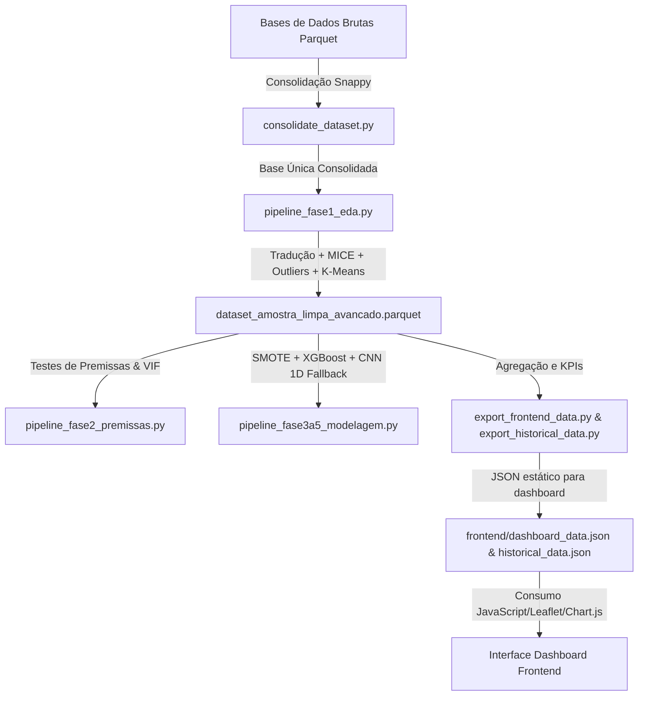

# Documentação Técnica Geral - Projeto TraficGenius

Bem-vindo à documentação completa do **TraficGenius**, uma solução integrada de engenharia de dados, inteligência artificial preditiva e visualização em tempo real focada na análise e mitigação da severidade de acidentes rodoviários.

Este documento fornece uma descrição detalhada de toda a arquitetura, do fluxo de dados e dos algoritmos do projeto, ideal para engenheiros de dados, cientistas de dados e desenvolvedores.

*Dicas de Inglês (English Tips):*
- *Project Overview* = Visão geral do projeto.
- *Data Pipeline* = Fluxo/esteira de dados.
- *State-of-the-Art (SOTA)* = Estado da arte (tecnologias mais avançadas atualmente disponíveis).
- *End-to-End Solution* = Solução de ponta a ponta (que vai desde a ingestão da base de dados bruta até a visualização no painel do usuário final).

---

## 🗺️ 1. Visão Geral (Overview)

O **TraficGenius** é projetado para analisar e prever os níveis de severidade (de 1 a 4) de acidentes de trânsito em rodovias interestaduais americanas. O principal objetivo é responder a duas grandes perguntas:
1. **Onde e quando** os acidentes mais graves têm maior probabilidade de ocorrer?
2. **Quais fatores** (climáticos, geográficos ou temporais) exercem o maior impacto na gravidade do acidente?

A resposta a essas perguntas permite que gestores públicos planejem ações preventivas de segurança viária e aloquem serviços de emergência médica de forma eficiente.

---

## 🏗️ 2. Arquitetura do Sistema (System Architecture)

O ecossistema do projeto está dividido em duas partes fundamentais:
* **Backend (Engenharia de Dados e Machine Learning):** Implementado em Python. É composto por uma série de pipelines modulares focados em processar eficientemente bases volumosas de dados Parquet, validar pressupostos estatísticos, treinar modelos preditivos robustos e exportar estatísticas agregadas.
* **Frontend (Dashboard de Visualização):** Desenvolvido com tecnologias web modernas (HTML5, Vanilla CSS com variáveis de escopo global e JavaScript assíncrono). Apresenta um mapa dinâmico para plotagem espacial e múltiplos gráficos interativos para consumo de métricas históricas e explicabilidade SHAP.



---

## ⚙️ 3. Pipeline de Inteligência Artificial e Dados (Data & AI Pipeline)

O processamento e modelagem são divididos em fases lógicas independentes que garantem a escalabilidade do sistema:

### Fase 1: Análise Exploratória (EDA), Engenharia de Recursos e Higienização
*Arquivo correspondente: [pipeline_fase1_eda.py](file:///C:/Users/samuelbarroso/Documents/Desenvolvimento/TraficGenius/pipeline_fase1_eda.py)*

1. **Leitura Otimizada de Memória (Memory-Efficient Reading):** Utiliza projeção de colunas para carregar do disco apenas os atributos necessários. O carregamento é baseado em blocos (*row groups*) usando PyArrow, permitindo ler milhões de linhas de arquivos Parquet comprimidos com Snappy em máquinas locais sem estourar a memória RAM (Out-of-Memory).
2. **Renomeação de Colunas para Português:** Traduz as 25 colunas originais do inglês para português do Brasil (`COLUMNS_MAPPING`) imediatamente após a leitura para melhorar a legibilidade e manutenabilidade do projeto.
3. **Engenharia de Atributos Temporais:** Extrai hora do dia, dia da semana e mês da data/hora do acidente, além de classificar automaticamente se o evento ocorreu em horários de pico (*rush hour*).
4. **Clustering Espacial de Zonas de Risco:** Processa as coordenadas de latitude e longitude usando o algoritmo **MiniBatchKMeans** para criar 20 zonas espaciais distintas que agrupam vias rodoviárias com perfis físicos de risco similares.
5. **Tratamento Avançado de Dados Ausentes (MICE):** Utiliza imputação múltipla via equações encadeadas (**IterativeImputer**) para preencher lacunas de variáveis meteorológicas faltantes (temperatura, umidade, vento, etc.) recursivamente, e preenchimento de variáveis categóricas pela moda.
6. **Remoção Híbrida de Outliers:** Combina dois métodos de filtragem para limpar ruídos multivariados dos dados meteorológicos:
   - *Linear (Distância de Mahalanobis):* Usa a matriz de covariância e a distribuição Qui-Quadrado ($p < 0.001$).
   - *Não-Linear (Isolation Forest):* Técnica de aprendizado de máquina isolando dados discrepantes em árvores de decisão.

### Fase 2: Testes de Premissas e Multicolinearidade
*Arquivo correspondente: [pipeline_fase2_premissas.py](file:///C:/Users/samuelbarroso/Documents/Desenvolvimento/TraficGenius/pipeline_fase2_premissas.py)*

1. **Testes de Normalidade e Homocedasticidade:** Realiza os testes estatísticos de Shapiro-Wilk, Kolmogorov-Smirnov e Levene para avaliar o comportamento de dispersão e homogeneidade de variâncias dos atributos contínuos em relação à severidade do acidente.
2. **Redução por VIF (Variance Inflation Factor):** Executa uma filtragem iterativa (*stepwise reduction*) que calcula a multicolinearidade das variáveis numéricas contínuas. Qualquer variável com VIF superior a 10 é descartada (exemplo: a temperatura foi eliminada por colinearidade extrema com a sensação térmica), restando apenas um conjunto linearmente estável de preditores.

### Fase 3 a 5: Balanceamento, Otimização e Treinamento de Modelos
*Arquivo correspondente: [pipeline_fase3a5_modelagem.py](file:///C:/Users/samuelbarroso/Documents/Desenvolvimento/TraficGenius/pipeline_fase3a5_modelagem.py)*

1. **Balanceamento Sintético (SMOTE):** Devido ao forte desbalanceamento de classes inerente a bases de trânsito (muito mais colisões leves do que acidentes graves/fatais), o pipeline aplica a técnica de superamostragem minoritária sintética no conjunto de treinamento para igualar a representatividade das classes.
2. **Modelagem Preditiva XGBoost (Tuned):** Instancia e executa uma otimização por busca aleatória (**RandomizedSearchCV**) controlando a profundidade das árvores, número de estimadores e taxa de aprendizado.
3. **Deep Learning CNN 1D (Fallback Resiliente):** Define uma rede neural convolucional profunda unidimensional no TensorFlow/Keras com camadas de normalização em lote (*BatchNormalization*), regularização *Dropout* para evitar sobreajuste (*overfitting*) e parada antecipada (*Early Stopping*).
   - *Fallback:* Possui tratamento nativo que detecta erros de inicialização das DLLs do TensorFlow no sistema do usuário. Caso falhe, o script treina e reporta o XGBoost normalmente sem interromper a execução do fluxo.
4. **Avaliação Avançada contra o Acaso:** Mede o desempenho real de precisão, revocação e pontuação F1-Macro contra as probabilidades teóricas baseadas no puro acaso (*Maximum Chance* e *Proportional Chance Criteria*).

---

## 📊 4. Painel de Controle e Visualização (Frontend Dashboard)

O painel é estruturado em uma página moderna com design de vidro fosco (*glassmorphism*), tema escuro e efeitos cibernéticos brilhantes, dividido nos seguintes arquivos em [frontend/](file:///C:/Users/samuelbarroso/Documents/Desenvolvimento/TraficGenius/frontend):

* **`index.html` & `styles.css`:** Criam o layout responsivo em grid com barra lateral de controle, cartões de KPIs rápidos e painéis de gráficos integrados. Possui um selecionador dinâmico de cores de neon (Color Picker) no cabeçalho.
* **`network-bg.js`:** Executa um fundo cibernético dinâmico no elemento `<canvas>` que desenha nós conectados por distância euclidiana, com aceleração e colisão elástica de partículas que se movem de forma suave.
* **`map.js`:** Configura o mapa de Leaflet, carregando blocos escuros e renderizando marcadores SVG circulares brilhantes posicionados geograficamente. As cores dos círculos refletem o grau de severidade do acidente (por exemplo, vermelho para acidentes Grau 4 e verde/ciano para colisões leves).
* **`charts.js`:** Gerencia as renderizações usando a biblioteca **Chart.js** (gráficos de rosca para severidade, séries temporais lineares com gradientes suavizados para acidentes dia/noite, e gráficos de barra horizontais para a importância das variáveis baseada na análise SHAP).
* **`app.js`:** Orquestra o ciclo de vida da interface. Dispara requisições assíncronas (`fetch`) para ler os dados gerados pelo Python e injetá-los nos KPIs e gráficos. Em caso de ausência da base física local, ele carrega automaticamente dados simulados (*fallback mock*) para manter a interatividade do painel.

---

## 📁 5. Estrutura do Repositório (Repository Structure)

Abaixo está o mapeamento dos arquivos que compõem o repositório principal:

```text
TraficGenius/
├── dataset/                        # Base de dados em formato Parquet comprimida e imagens de estatística
│   ├── train-00000.parquet
│   ├── dataset_consolidado.parquet # Base de dados física unificada
│   ├── dataset_amostra_limpa_avancado.parquet # Dataset limpo da Fase 1
│   └── matriz_correlacao.png       # Heatmap de correlação de Pearson gerado na Fase 2
├── frontend/                       # Código-fonte da interface de visualização
│   ├── index.html                  # Estrutura HTML5 do dashboard
│   ├── styles.css                  # Estilização CSS avançada (glassmorphism)
│   ├── app.js                      # Arquivo principal JavaScript do painel
│   ├── map.js                      # Inicializador e plotador do mapa Leaflet
│   ├── charts.js                   # Mapeador de gráficos do Chart.js
│   ├── network-bg.js               # Animação de fundo físico de partículas no Canvas
│   ├── dashboard_data.json         # Dados estáticos agregados para o dashboard
│   └── history/
│       └── historical_data.json    # Dados estatísticos complexos adicionais do radar/donut
├── histórico de conversa/          # Registros markdown das sessões de pair programming
├── tests/                          # Suíte de testes automatizados
│   ├── test_consolidation.py       # Teste unitário da consolidação de Parquets
│   └── test_pipeline_fase1.py      # Teste unitário da tradução de colunas
├── consolidate_dataset.py          # Script de concatenação física otimizada
├── pipeline_fase1_eda.py           # EDA, MICE, K-Means e Detecção de Outliers
├── pipeline_fase2_premissas.py     # Avaliação estatística de premissas e VIF
├── pipeline_fase3a5_modelagem.py   # Balanceamento e treinamento de modelos
├── export_frontend_data.py         # Extrator de métricas e KPIs padrão para JSON
├── export_historical_data.py       # Extrator de métricas de radar/donut para JSON
├── generate_notebook.py            # Reconstrutor automatizado do caderno Jupyter (.ipynb)
├── notebook.ipynb                  # Caderno interativo consolidando todas as fases
└── DOCUMENTACAO.md                 # Esta documentação geral do projeto
```

---

## 🧪 6. Testes Automatizados (Unit Testing)

A aplicação segue rigorosamente as práticas de desenvolvimento orientadas a testes (TDD). A suíte de testes valida dois grandes aspectos críticos de segurança e integridade de dados:
1. **Segurança de Junção:** Garante que o processo de consolidação de arquivos parquet segmentados não cause duplicação de dados, alterações nos tipos das variáveis ou perda de informações.
2. **Segurança na Tradução:** Garante que todas as 25 variáveis-chave sejam renomeadas corretamente para o português sem perdas ou falhas estruturais nos dataframes lidos.

Para executar todos os testes locais, execute no terminal da pasta raiz:
```bash
python -m unittest discover -s tests
```

---

## 🚀 7. Como Executar o Projeto (Getting Started)

Para reproduzir localmente todo o processamento de dados, modelagem de IA e rodar o dashboard interativo, siga os passos abaixo:

### Passo 1: Instalação das Dependências
Certifique-se de ter o Python 3.10 ou superior instalado e execute no terminal:
```bash
pip install pandas numpy pyarrow scipy scikit-learn xgboost imbalanced-learn matplotlib seaborn nbformat
```

### Passo 2: Consolidação dos Arquivos Parquet
Caso possua arquivos fragmentados no diretório `dataset` (ex: `train-00000.parquet`), junte-os executando:
```bash
python consolidate_dataset.py
```

### Passo 3: Executar a Análise de Dados (Fase 1)
Processe a amostragem, faça a engenharia de variáveis, tradução de colunas e limpeza rodando:
```bash
python pipeline_fase1_eda.py
```

### Passo 4: Rodar Testes de Premissas e VIF (Fase 2)
Valide as características lineares e remova colinearidades executando:
```bash
python pipeline_fase2_premissas.py
```

### Passo 5: Treinamento dos Modelos de Machine Learning (Fases 3 a 5)
Treine os classificadores de severidade digitando no terminal:
```bash
python pipeline_fase3a5_modelagem.py
```

### Passo 6: Exportação dos Resultados para o Frontend
Gere as métricas agregadas estruturadas para o painel executando:
```bash
python export_frontend_data.py
python export_historical_data.py
```

### Passo 7: Geração do Notebook Jupyter
Para recriar ou atualizar o caderno interativo do projeto:
```bash
python generate_notebook.py
```

### Passo 8: Visualizar o Dashboard
1. Navegue até a pasta `frontend`.
2. Abra o arquivo `index.html` em seu navegador web (pode ser clicando diretamente ou iniciando um servidor HTTP estático local, como o comando `npx serve .` ou `python -m http.server`).
3. Interaja com o mapa de severidades, explore a importância das features no gráfico SHAP e altere a cor temática do neon do painel!
